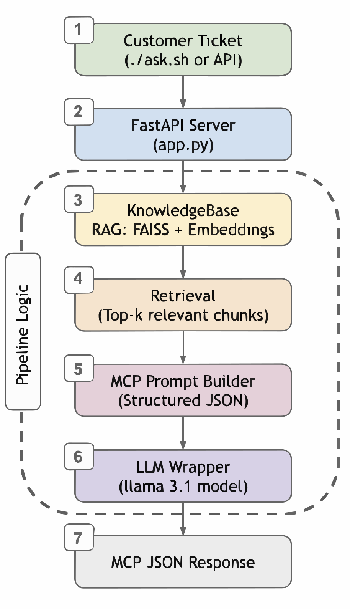

# Tucows AI Interview Exercise: Knowledge Assistant for Support Team

## Overview

This project is a small Retrieval-Augmented Generation (RAG) system designed to help support teams handle customer tickets more quickly and consistently. It pulls from documentation and predefined policy FAQs, finds the most relevant context, and returns a JSON response with an answer, references, and a recommended action.

Everything runs in Docker Compose to ensure an easy setup:

- FastAPI serves the Knowledge Assistant API

- Ollama runs the language model locally (default: llama3.1:latest)

- A single docker compose up brings the whole system online

The result is that support agents get clear, structured answers without having to search through docs themselves.

---

## Features 

- **Context-aware answers** – looks up the most relevant chunks from documentation and policies before replying.  
- **MCP-compliant output** – always returns JSON with `answer`, `references`, and `action_required`.  
- **Expandable action set** – includes common support workflows like WHOIS updates, abuse escalation, billing, and more.  
- **Containerized setup** – everything runs through Docker Compose with one command.  
- **Interactive testing** – use `./ask.sh` to simplify the input process, one can type a ticket and get an instant JSON reply.  
- **Unit tested** – core pieces (models, RAG, LLM integration) covered with simple pytest tests.  

## Architecture 

The system has three main pieces that work together:

1. **Knowledge Base (RAG)**  
   - Loads support docs and policies.  
   - Splits them into overlapping chunks.  
   - Embeds each chunk using SentenceTransformers.  
   - Stores embeddings in a FAISS index for fast retrieval.  

2. **LLM (via Ollama)**  
   - Takes the top-k relevant chunks + the ticket text.  
   - Generates a JSON answer that follows the MCP schema.  
   - Default model: `llama3.1:latest`.  

3. **FastAPI Service**  
   - Exposes a `/resolve-ticket` endpoint.  
   - Accepts raw ticket text, retrieves context, calls the LLM, and returns structured JSON.  
   - Includes a `/ping` endpoint for health checks.  

The following image depicts the system architecture: 

